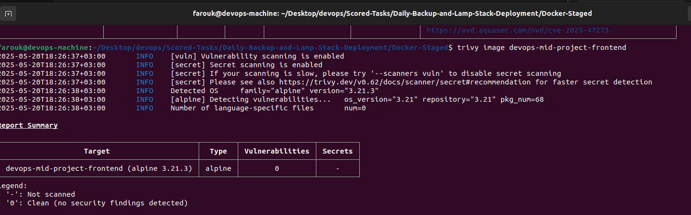

# DevOps Mid-Project Deployment Pipeline

## Config Branch Pipeline
  

## Main Branch Pipeline
  

## Project Structure

Main Directory/  
├── backend/  
│ ├── src/ # Backend application source   
│ ├── static/ # Static files   
│ ├── Dockerfile # Backend Docker configuration  
│ └── requirements.txt # Python dependencies  
│
├── frontend/  
│ ├── public/ # Public assets  
│ ├── src/ # React application source  
│ ├── Dockerfile # Frontend Docker configuration  
│ └── nginx.conf # Nginx configuration  
│
├── database/  
│ └── Dockerfile # Custom PostgreSQL configuration  
│
├── roles/ # Ansible configuration  
│ ├── docker-install/  
│ └── docker-login/  
│ 
├── docker-compose.yml # Multi-container orchestration  
├── inventory.ini # Ansible inventory  
├── site.yml # Ansible playbook  
└── .gitlab-ci.yml # CI/CD pipeline configuration  

## CI/CD Pipeline Stages
1. **Notify**: Slack deployment notifications
2. **Config**: EC2 instance provisioning with Ansible
3. **Build**: Dependency installation for backend/frontend
4. **Test**: Linting and unit testing
5. **Dockerization**: Container image building
6. **Security Scan**: Vulnerability scanning with Trivy
7. **Deploy**: Image deployment to EC2

## Key Features
- Automated security scanning with Trivy
- Slack deployment notifications
- Ansible-managed infrastructure
- Isolated Docker builds for each component
- Manual approval for production deployment

## Security Scanning Results

### Initial Vulnerability Scan
1. Frontend Vulnerabilities  
 
2. Postgres Vulnerabilities  
 
3. Backend Vulnerabilities  

### Remediation Actions
* Removed unnecessary packages
* Update packages that needs upgrading
* Implemented least-privilege user principles

### Post-Fix Scan Results
1. Frontend Vulnerabilities Fixed  
 
2. Postgres Vulnerabilities  

3. Backend Vulnerabilities Fixed  
 

**Improvements:**
- 0 Critical vulnerabilities
- 0 high-severity vulnerabilities
- 0 medium-severity vulnerabilities
- 0 low-severity vulnerabilities

### Detailed Job Breakdown:

#### 1. `slack-notify` (Stage: notify)

- **Purpose**: Sends a Slack notification about the new deployment.

- **Script**: Uses `curl` to send a JSON payload to a Slack webhook.

- **Details**: The message includes project name, branch, pipeline URL, commit details, and the deployer's name.

#### 2. `config-deployment-machine` (Stage: config)

- **Purpose**: Configures the EC2 instance using Ansible.

- **Before Script**:

    - Sets up SSH.

    - Downloads a secure file (SSH key) to access the EC2 instance.

    - Updates `/etc/hosts` with the EC2 instance's IP and hostname.

    - Scans the EC2 host's SSH keys.

    - Installs Ansible.

- **Script**: Runs the Ansible playbook `site.yml` using the provided inventory file and private key.

- **Only**: Runs only on the branch `config_branch`.

#### 3. `build-backend` (Stage: build)

- **Purpose**: Builds the backend Python application.

- **Image**: Uses `python:3.10`.

- **Script**:

    - Creates a virtual environment.

    - Installs dependencies from `requirements.txt`.

- **Artifacts**: Saves the virtual environment, source code, and requirements file for subsequent jobs.

- **Only**: Runs on the `main` branch.

#### 4. `lint-backend` (Stage: test)

- **Purpose**: Lints the backend Python code.

- **Image**: Uses `python:3.10`.

- **Script**:

    - Installs `flake8`.

    - Runs `flake8` on the `src/` directory.

- **Needs**: Depends on `build-backend` to have the source and virtual environment.

- **Only**: Runs on the `main` branch.

#### 5. `test-backend` (Stage: test)

- **Purpose**: Runs backend tests.

- **Image**: Uses `python:3.10`.

- **Services**: Uses a PostgreSQL service for testing.

- **Variables**: Sets environment variables for the PostgreSQL connection.

- **Script**:

    - Installs `pytest`.

    - Runs `pytest` on the `src/` directory.

- **Needs**: Depends on `build-backend`.

- **Only**: Runs on the `main` branch.

#### 6. `docker-build-backend` (Stage: dockerization)

- **Purpose**: Builds the Docker image for the backend.

- **Image**: Uses `docker:latest`.

- **Services**: Uses Docker-in-Docker (dind) to build the image.

- **Script**:

    - Builds the Docker image and tags it with `$BACKEND_IMAGE`.

    - Saves the image as a tarball (`backend-image.tar`).

- **Artifacts**: The tarball is saved as an artifact.

- **Needs**: Requires both `lint-backend` and `test-backend` to pass.

- **Only**: Runs on the `main` branch.

#### 7. `trivy-backend` (Stage: security-scan)

- **Purpose**: Scans the backend Docker image for vulnerabilities.

- **Extends**: Uses the predefined `.container_scanning` job template.

- **Variables**: Specifies the tarball and image name for scanning.

- **Script** (from template):

    - Downloads the Trivy vulnerability database.

    - Scans the image and outputs a report in JSON format (for GitLab).

    - Also runs a scan that exits with code 0 (for report) and then with code 1 if critical vulnerabilities are found.

- **Needs**: Depends on `docker-build-backend` for the image tarball.

- **Only**: Runs on the `main` branch.

#### 8. `build-frontend` (Stage: build)

- **Purpose**: Builds the frontend Node.js application.

- **Image**: Uses `node:18`.

- **Script**:

    - Installs dependencies with `npm install`.

    - Builds the application with `npm run build`.

- **Artifacts**: The `build/` directory is saved.

- **Cache**: Caches `node_modules` for faster subsequent runs.

- **Only**: Runs on the `main` branch.

#### 9. `lint-frontend` (Stage: test)

- **Purpose**: Lints the frontend code.

- **Image**: Uses `node:18`.

- **Script**:

    - Installs ESLint and plugins.

    - Runs `npm run lint`.

- **Needs**: Depends on `build-frontend`.

- **Only**: Runs on the `main` branch.

#### 10. `test-frontend` (Stage: test)

- **Purpose**: Runs frontend tests (currently just an echo, needs implementation).

- **Image**: Uses `node:18`.

- **Script**: Currently just echoes a message (should be replaced with actual tests).

- **Needs**: Depends on `build-frontend`.

- **Only**: Runs on the `main` branch.

#### 11. `docker-build-frontend` (Stage: dockerization)

- **Purpose**: Builds the Docker image for the frontend.

- **Image**: Uses `docker:latest`.

- **Services**: Uses Docker-in-Docker.

- **Script**:

    - Builds the Docker image and tags it with `$FRONTEND_IMAGE`.

    - Saves the image as a tarball (`frontend-image.tar`).

- **Artifacts**: The tarball is saved.

- **Needs**: Requires `lint-frontend` and `test-frontend` to pass.

- **Only**: Runs on the `main` branch.

#### 12. `trivy-frontend` (Stage: security-scan)

- **Purpose**: Scans the frontend Docker image.

- **Extends**: The `.container_scanning` template.

- **Variables**: Specifies the frontend tarball and image name.

- **Needs**: Depends on `docker-build-frontend`.

- **Only**: Runs on the `main` branch.

#### 13. `docker-build-postgres` (Stage: dockerization)

- **Purpose**: Builds a custom PostgreSQL Docker image.

- **Image**: Uses `docker:latest`.

- **Services**: Uses Docker-in-Docker.

- **Script**:

    - Builds the image and tags it with `$POSTGRES_IMAGE`.

    - Saves the image as a tarball (`postgres-image.tar`).

- **Artifacts**: The tarball is saved.

- **Only**: Runs on the `main` branch.

#### 14. `trivy-postgres` (Stage: security-scan)

- **Purpose**: Scans the PostgreSQL Docker image.

- **Extends**: The `.container_scanning` template.

- **Variables**: Specifies the PostgreSQL tarball and image name.

- **Needs**: Depends on `docker-build-postgres`.

- **Only**: Runs on the `main` branch.

#### 15. `docker-copy-images` (Stage: deploy)

- **Purpose**: Copies the Docker images and `docker-compose.yml` to the EC2 instance and loads the images.

- **Image**: Uses `docker:latest`.

- **Services**: Uses Docker-in-Docker.

- **Before Script**: Sets up SSH (similar to the config job) to access the EC2 instance.

- **Script**:

    - Copies the three image tarballs and `docker-compose.yml` to the EC2 instance.

    - Runs `docker load` on each image tarball on the EC2 instance.

- **Needs**: Requires the three Trivy scan jobs and the three Docker build jobs (with artifacts).

- **Only**: Runs on the `main` branch.

#### 16. `docker-compose` (Stage: deploy)

- **Purpose**: Deploys the application on the EC2 instance using Docker Compose.

- **Image**: Uses `docker:latest`.

- **Services**: Uses Docker-in-Docker.

- **Before Script**: Sets up SSH (same as above).

- **Script**:

    - SSH into the EC2 instance and run `docker-compose down` (with environment variables for image names).

    - Then run `docker-compose up -d` (with the same environment variables).

- **Needs**: Depends on `docker-copy-images`.

- **When**: `manual` (requires manual approval to deploy).

- **Only**: Runs on the `main` branch.

### Pipeline Flow:

1. **Start**: Triggered by a commit to the `main` branch (or `config_branch` for the config job).

2. **Notify**: Sends a Slack notification.

3. **Config**: Only runs on `config_branch` to set up the EC2 instance (if that branch is updated).

4. **Build and Test**:

    - Backend: build -> lint -> test.

    - Frontend: build -> lint -> test.

    - PostgreSQL: built independently.

5. **Dockerization**: Each component (backend, frontend, PostgreSQL) is built as a Docker image.

6. **Security Scan**: Each Docker image is scanned by Trivy. If any critical vulnerabilities are found, the pipeline fails (due to `--exit-code 1` in Trivy).

7. **Deploy**:

- `docker-copy-images`: Copies the images and compose file to EC2 and loads the images (automatic on success of security scans).

- `docker-compose`: Manual step to stop and start the containers on EC2.

**Note:** The `docker-compose` job is manual, meaning after the pipeline runs successfully up to that point, someone must manually trigger the deployment.

This pipeline ensures that code is built, tested, scanned for vulnerabilities, and then deployed (with manual approval) to an EC2 instance.

## Environment Variables

| Variable              | Description                                                                 |
|-----------------------|-----------------------------------------------------------------------------|
| `EC2_IP`              | IP address of the deployment server (EC2 instance)                         |
| `EC2_HOSTNAME`        | Hostname of the deployment server |
| `BACKEND_IMAGE`       | Docker image name for the backend service  |
| `FRONTEND_IMAGE`      | Docker image name for the frontend service |
| `POSTGRES_IMAGE`      | Docker image name for the PostgreSQL database |
| `DOCKERHUB_USERNAME`  | Docker Hub username for image pushing/pulling |
| `DOCKERHUB_PASSWORD`  | Docker Hub password for image pushing/pulling  |

## Environment Secure Files

| File              | Description                                                                 |
|-----------------------|-----------------------------------------------------------------------------|
| `gitlab-test.pem`              | Private Key of EC2 instance (for ssh)                         |

## Quick Start
1. **Clone** repo
2. Create **EC2** instance
    * Launch Ubuntu 22.04 LTS instance (t3.medium recommended)
    * Create new key pair (project-key.pem)
    * Note public IPv4 address/DNS name
3. Enable **SSH**, **HTTP**, and other required **ports** you might need from **secuirty groups** in AWS consule (e.g., `8080` and `5000`)
4. Add your **variables** and **secure files** to the project
5. Run **Config** branch pipeline
6. Run **Main** branch pipeline

## Coverage check outputs

### Testing Frontend

### Testing Functianality 

### Testing Backend

